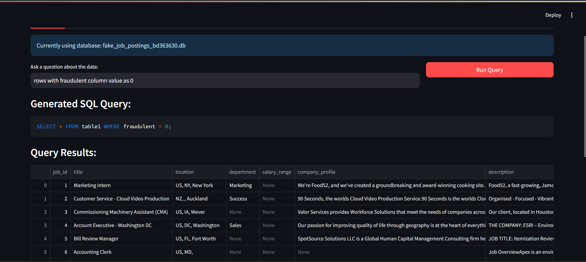

# SQL Natural Language Query Assistant

## Overview

SQL Natural Language Query Assistant is a powerful Streamlit application that lets you interact with tabular data using everyday language instead of complex SQL queries. This tool bridges the gap between data analysis and natural language processing, making data exploration accessible to everyone, regardless of their SQL expertise.




## Key Features

- **Natural Language to SQL Conversion**: Ask questions about your data in plain English and get SQL queries automatically generated
- **CSV Import**: Upload any CSV file and instantly convert it to a queryable SQLite database
- **Database Management**: Create, store, and switch between multiple databases
- **Interactive Results**: View query results in interactive tables with sorting and filtering capabilities
- **Dynamic Schema Analysis**: Automatically adapts to any dataset structure
- **Database Reference**: Explore table structures and sample data for better understanding

## Use Cases for Data Scientists

### 1. Exploratory Data Analysis (EDA)

Use natural language to quickly explore and understand new datasets:
- "What is the average age of customers by region?"
- "Show me the top 10 products by sales volume"
- "Count unique values in the status column"

### 2. Kaggle Dataset Analysis

Download datasets from Kaggle and immediately start exploring without writing SQL:
- Upload the CSV directly from your Kaggle download
- Get insights with simple questions
- Perform comparative analysis across different datasets

### 3. Data Cleaning

Identify data quality issues with natural language queries:
- "Find all records where price is null"
- "Show transactions with abnormal values"
- "Count missing values in each column"

### 4. Dataset Visualization Preparation

Prepare data for visualization tools by querying specific subsets:
- "Extract all sales data from the last quarter"
- "Get customer data grouped by age bracket"
- "Find patterns in customer behavior across different regions"

## Installation and Setup

### Prerequisites

- Python 3.7+
- pip

### Installation Steps

1. Clone this repository:
   ```bash
   git clone https://github.com/hk151109/SQL_Assistant.git
   cd SQL_Assistant
   ```

2. Install dependencies:
   ```bash
   pip install -r requirements.txt
   ```

3. Set up your Google Gemini API key:
   - Create a `.env` file in the project root
   - Add your API key: `GEMINI_API_KEY=your_api_key_here`

4. Run the application:
   ```bash
   streamlit run app.py
   ```

## How It Works

### 1. CSV Import & Database Creation

- **`import_csv_to_sqlite()`**: Converts CSV files to SQLite databases
  - Preserves data types and structure
  - Creates metadata for future reference
  - Enables persistent storage of imported datasets

### 2. Natural Language Processing

- **`get_gemini_response()`**: Processes natural language questions
  - Sends the question to Google's Gemini AI
  - Includes database schema information for context
  - Returns a formatted SQL query

### 3. Database Operations

- **`read_sql_query()`**: Executes SQL queries against databases
  - Handles potential errors and edge cases
  - Returns structured data for display
  - Preserves column names and data types

- **`get_table_info()`**: Analyzes database structure
  - Extracts table schemas
  - Retrieves sample data
  - Enables dynamic prompt generation

### 4. Dynamic Prompt Engineering

- **`generate_prompt()`**: Creates customized prompts for AI
  - Includes database structure details
  - Adapts to any database schema
  - Ensures accurate query generation

## Example Workflow

1. Upload a Kaggle dataset (CSV file)
2. The system automatically creates a SQLite database
3. Ask questions about your data in plain English
4. View the generated SQL query and results
5. Refine your questions to explore deeper insights

## Common Queries for Data Analysis

- "How many records are there in each category?"
- "What's the distribution of values in column X?"
- "Show me the correlation between X and Y"
- "Find outliers in the dataset"
- "Compare average values across different groups"

## Advanced Features

### Database Management

The application maintains a database of databases, allowing you to:
- Switch between different datasets
- Compare results across multiple sources
- Build a library of queryable datasets

### Query History

Each session maintains a history of queries, enabling:
- Progressive refinement of questions
- Building complex analyses step by step
- Learning SQL patterns through observation

## Limitations

- Complex joins across multiple tables might require more specific questions
- Very large datasets (>1GB) may experience performance issues
- The AI might occasionally misinterpret ambiguous questions

## Troubleshooting

- If your query returns an error, try rephrasing the question
- Ensure your CSV has clean column headers without special characters
- For large datasets, consider filtering or sampling before upload

## Contributing

Contributions are welcome! Please feel free to submit a Pull Request.

